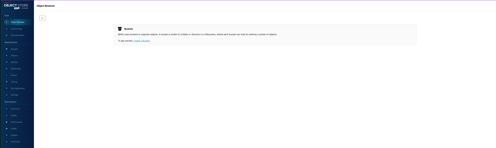
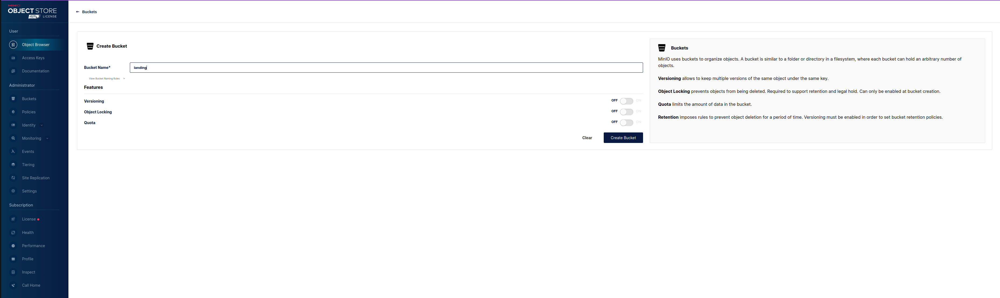
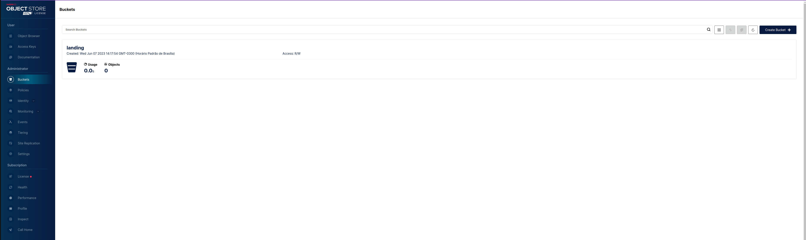
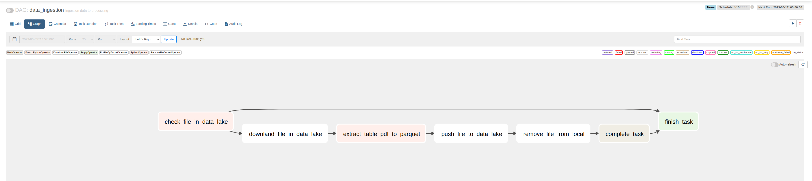
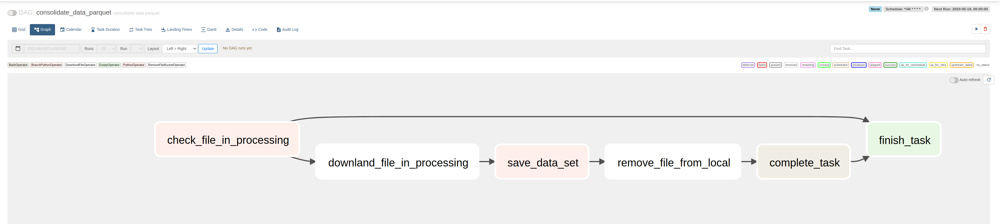

# Car sales ETL project in the month
The idea of ​​the project is to obtain vehicle registration data. Both private and commercial. And these data can be found on the website https://www.fenabrave.org.br/portalv2. It is a portal that provides a pdf document of vehicle registrations every month.

The challenge proposed in the project is to obtain these documents in pdf, extract the information about the licensing and save it in the database.
---

# Tools used:
- Airflow for capturing datapipelines
- Minio Data Lake responsible for storing processed files
- Postgres- database responsible for storing the final data
- docker-compose: responsible for running minio and postgres containers
---
# Installation process

Define an environment variable, why use anaconda, pyenv or any one you prefer. **Note: This project used python 3.10.0**

After defining your environment variable, activate it to install the project's dependencies. Then type the command:

- pip install -r requirements.txt

After installation enter the command:
- source .env

This command will export the environment variables that are defined in the .env file. In this file, variables are defined that contain accessible values ​​such as database name, user, password, database connection string, etc.

After exporting the .env, enter the command:
- docker-compose up -d

This command is responsible for starting all dokcer services like the postgres database and datalake minio.

# Data Lake Configuration
In the browser, go to http://172.16.238.10:9001/browser. This ip is responsible for accessing the data lake panel.

your access user is defined in the .env (MINIO_ROOT_USER, MINIO_ROOT_PASSWORD)

After logging in, go to create a bucket

After creating the first bucker landing who is responsible for storing the pdfs to be processed further.

Go to create bucket to create processing. This is responsible for storing the processed pdf objects (these are the sales data extracted from the pdf)
After creating the landing and processing buckets, the data lake configuration is finished.

In the terminal type the command:
- bash init_airflow.sh

Command responsible for initializing the airflow, creating the access user and migrating the table in the data bank.

---
# Flow developed in DAGs

The first dag developed **data_ingestion** has as its main objective to check every 15 minutes the bucket landing in the data lake. Checking for new pdf files to download. If so, the download and extraction process of the pdf data is made. It is then saved as a parquet file (file type used for data processing). It is then uploaded to the data lake in the bucket processing.

The second dag developed **consolidate_data_parquet** runs every 40 minutes checking for new files in the data lake in processing. If it has been downloaded. It is then checked in the database if the files to be processed already exist in the database. If not, it is saved in the bank. Otherwise it is ignored.

